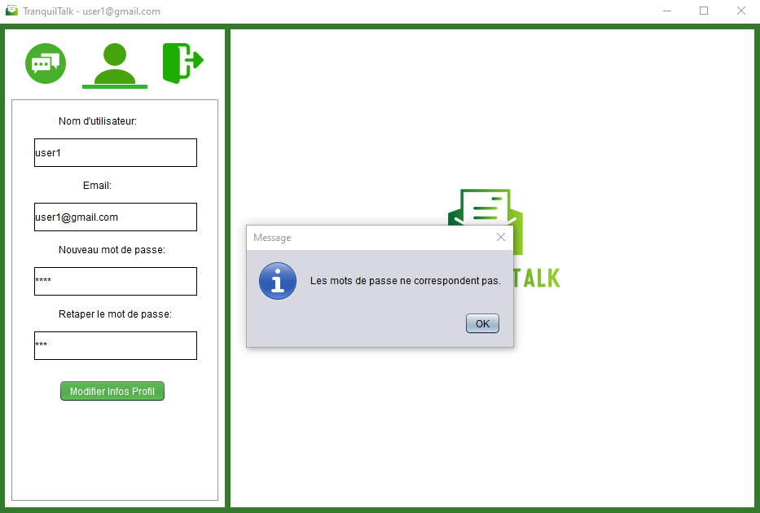
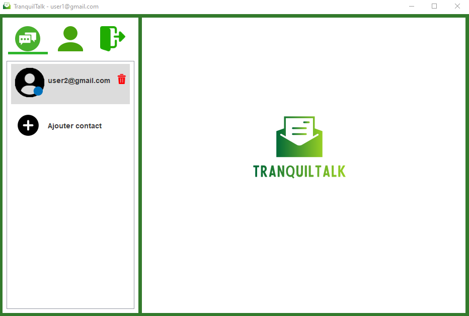
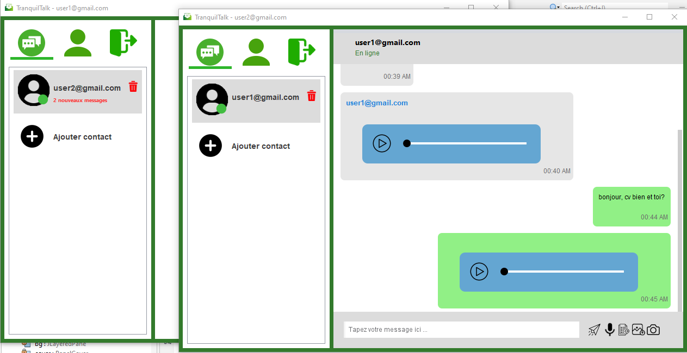

# TranquilTalk

TranquilTalk is a desktop application that aims to manage one-to-one online and offline text, audio and file messaging, using emails while connecting or registering to access.

## Group members:

This academic project is realized by:

- ADBIB Ilham
- BOUGHAIT Farah
- DAHIA Soukaina
- EL MADANI Khadija
- LAMRINI Imane

## Used technologies:

This desktop application is made using the following technologies:

- **Java** (as a backend technology for the management of the code)
- **Java Swing** (for making a robust GUI of the application)
- **MySQL** (for relational database management)

## Technical requirements:

The application is based on a Client-Server model using:
- Socket architecture (TCP/UDP as per specifications).
- Serialization and threading technologies in Java.

## Main functionalities:

Clients can connect to the service using their email address to:

- Check the status of their contacts (online/offline).
- Receive messages and notifications received while they were away.
- Communicate with their contacts (message, file, etc.).
- Log out of the application.
- Manage their account and contact list.

## Screens of the app:

  
  
  
  
  
  
  
  
  
  
  
  
  
  
  
  
  
  
  
 
